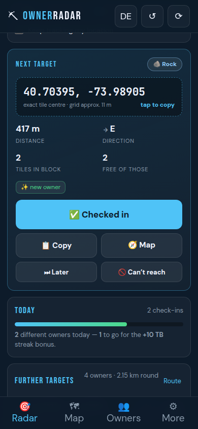
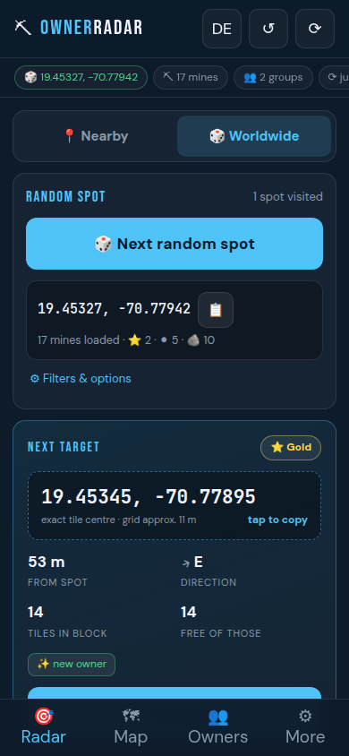
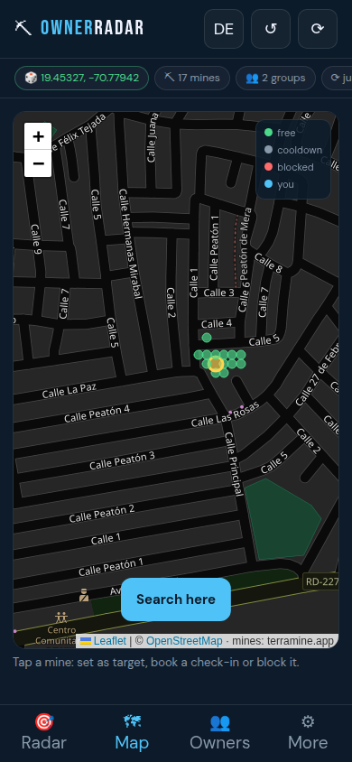

# Owner Radar — TerraMine Check-in Tracker

[🇬🇧 English](README.md) · 🇩🇪 Deutsch

Findet die **nächste Mine eines Owners, bei dem du in den letzten 24 Stunden nicht eingecheckt
hast** — mit exakten Koordinaten, Laufroute und Cooldown-Verwaltung. Reine statische Website, läuft
direkt auf GitHub Pages, ohne Server und ohne Account, Oberfläche auf Englisch und Deutsch.

<p>
  
  
  
</p>

## Zwei Betriebsarten

| Modus | wofür |
|---|---|
| 📍 **Umkreis** | Ziele rund um deinen eigenen Standort — für die Runde vor der Haustür |
| 🎲 **Weltweit** | ein zufälliger Ort irgendwo auf der Welt, per Knopfdruck neu gewürfelt |

Beim Würfeln zieht die App eine beliebige Gegend aus der weltweiten Minen-Übersicht (rund 44.000
Gegenden, 800.000+ Minen), lädt dort die exakten Felder und zeigt sofort das nächste Ziel. Findet
sich dort kein freier Owner, würfelt sie automatisch weiter — bis zu sechsmal. Über *Filter &
Optionen* lässt sich einstellen, wie viele Minen mindestens vor Ort sein sollen und ob nur Gegenden
**mit Diamant, Gold oder Kohle** gezogen werden. Besuchte Orte merkt sich die App und überspringt
sie beim nächsten Wurf.

## Was das Tool macht

1. **Standort setzen** (GPS, Koordinaten eintippen — oder 🎲 würfeln).
2. Es lädt live alle TerraAcres im Umkreis von den öffentlichen TerraMine-Endpunkten — denselben,
   die auch die offizielle Weltkarte (`terramine.app/heatmap.html`) benutzt.
3. Zusammenhängende Felderblöcke werden zu **Owner-Gruppen** zusammengefasst.
4. Du bekommst **ein Ziel pro Owner** mit exakter Feldmitte auf 5 Nachkommastellen, Entfernung,
   Himmelsrichtung und Navigations-Link. **Ein Tipp auf die Koordinaten kopiert sie** in die
   Zwischenablage (mit sicht- und spürbarer Bestätigung); dieselbe Kopierfunktion gibt es in jeder
   Zeile der Route, am Zufallsort und in der Karte.
5. Nach dem Check-in in der TerraMine-App tippst du hier **✅ Check-in gemacht** — der Owner
   verschwindet für 24 Stunden aus den Vorschlägen und du siehst, wann er wieder frei wird.
6. Darunter steht die **Laufroute** durch die übrigen Owner (Nearest-Neighbour, mit Gesamtstrecke) —
   praktisch für den Streak-Bonus (3 / 5 / 10 verschiedene Owner am Tag = +10 / +25 / +50 TB).

## Auf GitHub Pages veröffentlichen

**Variante A — ohne Actions (am einfachsten)**

1. Repository → **Settings** → **Pages**
2. *Source*: **Deploy from a branch**
3. *Branch*: `claude/terramine-mine-tracker-mdxdex` (oder `main`, nachdem du gemergt hast), Ordner **`/ (root)`** → **Save**
4. Nach ein bis zwei Minuten liegt die Seite unter `https://<dein-name>.github.io/terramine/`

**Variante B — mit Actions**

*Source* auf **GitHub Actions** stellen. Der Workflow `.github/workflows/pages.yml` veröffentlicht
dann bei jedem Push auf `main` oder `claude/terramine-mine-tracker-mdxdex` (und manuell über *Run
workflow*).

**Fürs Handy gebaut**: Ein-Spalten-Layout, alle Bedienelemente mindestens 40–48 px hoch, kein
seitliches Scrollen bis hinunter zu 360 px Displaybreite, Bedienung unten am Daumen, Ziel direkt
über der Falz. Der gewürfelte Ort und alle Daten überleben den Wechsel in die TerraMine-App und
zurück.

**Auf dem Handy**: Seite öffnen → *Zum Startbildschirm hinzufügen*. Die App-Hülle wird per Service
Worker gecacht und startet auch bei schlechtem Empfang; die Minen-Daten kommen weiter live aus dem
Netz. GPS funktioniert nur über HTTPS — die Pages-URL erfüllt das.

## Sprache

Die Oberfläche startet auf **Englisch** und wechselt mit dem `DE`-Knopf in der Kopfzeile (oder unter
*Mehr → Sprache*) auf **Deutsch**. Die Wahl bleibt gespeichert und stellt auch Zahlenformate,
Himmelsrichtungen und Datumsangaben um.

## Bedienung

| Element | Bedeutung |
|---|---|
| **Radar** | Modus-Umschalter 📍/🎲, nächstes Ziel, Laufroute, Cooldown-Übersicht, Tages-Streak |
| **Karte** | Alle Minen im Umkreis: grün = frei, grau = Cooldown, rot = gesperrt, gelb = aktuelles Ziel |
| **Owner** | Alle erfassten Owner mit Restzeit; umbenennen, zusammenführen, Cooldown aufheben |
| **Mehr** | Sprache, Radius, Cooldown-Dauer, Blockabstand, Typfilter, Verlauf, Export/Import |

- **Koordinaten antippen** kopiert sie in die Zwischenablage — Format `52.52000, 13.40500`.
- **⏭ Später** blendet eine Gruppe für 3 Stunden aus (z. B. gerade nicht auf dem Weg).
- **🚫 Nicht erreichbar** sperrt eine einzelne Mine dauerhaft oder befristet (Privatgelände, Gebäude, Wasser).
- **↺ oben rechts** macht die letzte Aktion rückgängig; einzelne Check-ins lassen sich im Verlauf
  (Tab *Mehr*) auch später noch löschen.

## Owner-Erkennung — wie zuverlässig ist das?

Die öffentliche API gibt **keine Owner-IDs** heraus, nur Koordinate und Minentyp. Deshalb:

- **Schätzung:** ein zusammenhängender Block von Feldern (Standard: höchstens 25 m Abstand) gilt als
  *ein* Owner. Spieler bauen ihre TerraAcres praktisch immer als Block um Zuhause, Arbeit oder Schule.
- **Deine Bestätigung schlägt die Schätzung:** trägst du beim Abhaken den Ownernamen aus dem Spiel
  ein, merkt sich der Radar den Namen für den ganzen Block. Taucht derselbe Name an einer anderen
  Stelle wieder auf, teilen sich beide Blöcke einen Cooldown.
- **Dichte Innenstadtblöcke** können mehreren Ownern gehören. Setz beim Check-in den Haken
  *„Dieser Block gehört mehreren Ownern"* — dann sperrt ein Check-in nur die 30 m rundherum statt
  des ganzen Blocks.
- **Blockabstand** (Tab *Mehr*) steuert, wie großzügig zusammengefasst wird: kleiner = mehr, feinere
  Gruppen; größer = weniger, gröbere Gruppen.

Der Check-in selbst passiert weiter in der TerraMine-App vor Ort (das Spiel prüft die GPS-Nähe).
Dieses Tool plant die Runde und führt Buch.

## Daten und Privatsphäre

Alles — Owner, Cooldowns, Check-ins, Einstellungen — liegt ausschließlich im `localStorage` deines
Browsers. Nichts wird hochgeladen, es gibt keinen Account und kein Tracking. Vor einem Gerätewechsel
oder dem Leeren des Browser-Speichers: *Mehr → Daten → Export*, auf dem neuen Gerät importieren
(wahlweise zusammenführen oder ersetzen).

Abgefragt werden nur diese beiden öffentlichen Endpunkte, immer nur für deinen Umkreis:

```
GET .../getPropertiesInViewport?minLat=&maxLat=&minLng=&maxLng=   → Minen im Ausschnitt
GET .../getHeatmapData                                            → weltweite Gegenden-Übersicht (nur im Weltmodus)
```

Die Weltübersicht (ca. 3,6 MB) wird erst geladen, wenn du sie anforderst, dann 24 Stunden lokal
gespeichert — der zweite Wurf braucht kein Netz mehr für die Ortsauswahl.

## Entwicklung

```bash
npm test          # 59 Tests der Kernlogik (Cluster, Cooldowns, Route, Zufallsorte, Sprachen, Import/Export)
npm start         # lokaler Server auf http://localhost:8080
node tests/e2e.js # Browsertest mit Playwright: echte Daten, Check-in, Weltmodus, Zwischenablage, Sprachen
```

| Datei | Inhalt |
|---|---|
| `assets/js/i18n.js` | Englische und deutsche Texte, `t()`, Übersetzung des Markups |
| `assets/js/util.js` | Geo-Mathematik, Formate, IDs |
| `assets/js/cluster.js` | Blockbildung (Union-Find über ein Meter-Raster) |
| `assets/js/world.js` | Zufallsorte: Zellen filtern, ziehen, Suchfenster berechnen |
| `assets/js/store.js` | Owner, Cooldowns, Zielauswahl, Route, Import/Export |
| `assets/js/api.js` | TerraMine-Endpunkte inkl. Offline-Cache |
| `assets/js/app.js` | Oberfläche |
| `tests/run.js` | Unit-Tests (`node --test`) |
| `tests/e2e.js` | Browsertest (Playwright, optional) |

## Rechtliches

Inoffizielles Hilfsmittel, nicht mit TerraMine verbunden. Es nutzt ausschließlich öffentlich
abrufbare Endpunkte, ändert nichts im Spiel und automatisiert keine Spielaktionen — Check-ins
machst weiterhin du selbst in der App. Kartendarstellung: © OpenStreetMap-Mitwirkende.

MIT-Lizenz.
